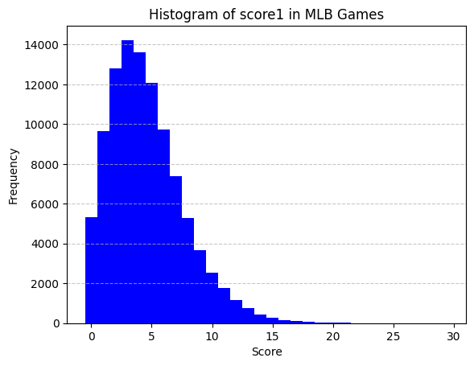
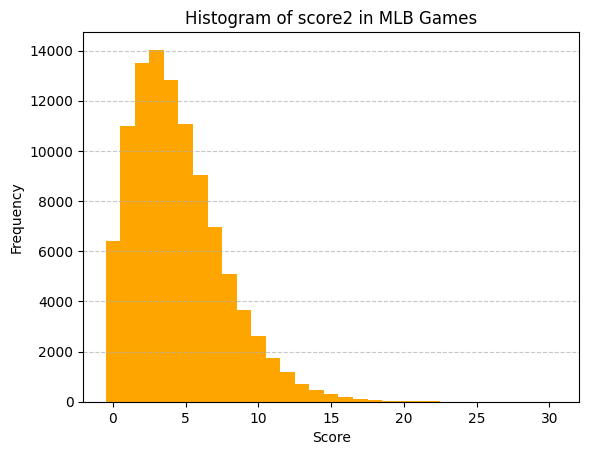
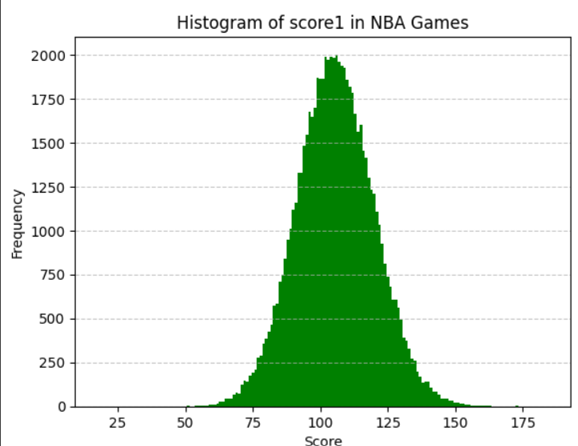
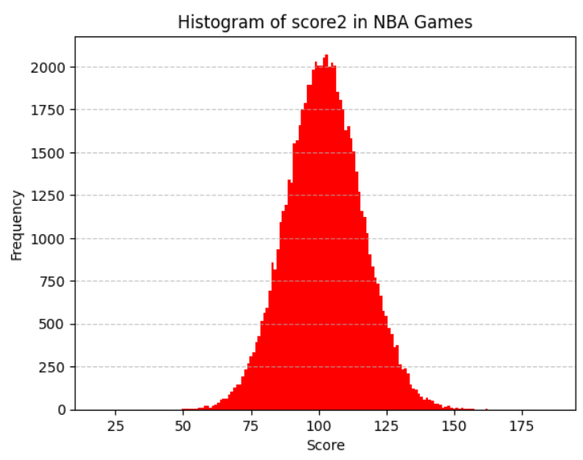
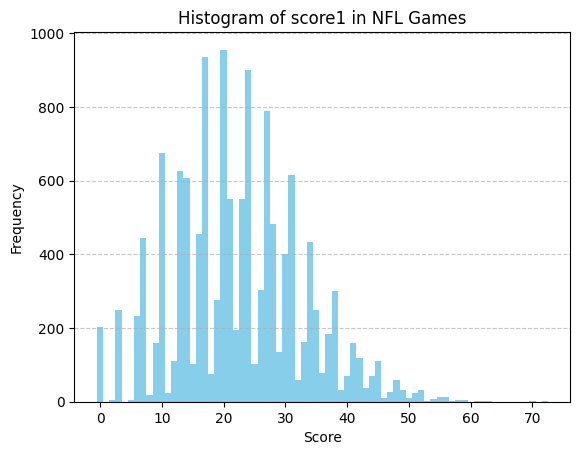
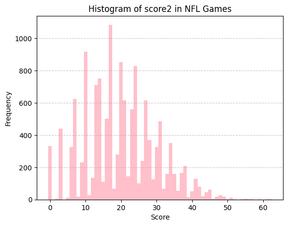

# About this directory: `data/us_leagues`

***Note: This markdown has just been migrated from PDF versions of EDA reports, some figures and tables are still under constructing.***

## Table of Contents
- [0 Data Dictionary](#0-data-dictionary)
  - [0.1 Data Dictionary for game-by-game datasets](#01-data-dictionary-for-game-by-game-datasets-tables-by-leages-and-combined)
  - [0.2 Data Dictionary for end-of-season rankings](#02-data-dictionary-for-end-of-season-rankings)
- [1 MLB Data](#1-mlb-data)
  - [1.1 Dimension](#11-dimension)
  - [1.2 Descriptive Statistics](#12-descriptive-statistics)
  - [1.3 Discussion](#13-discussion)
  - [1.4 MLB Reference](#14-mlb-reference)
- [2 NBA Data](#2-nba-data)
  - [2.1 Dimension](#21-dimension)
  - [2.2 Descriptive Statistics](#22-descriptive-statistics)
  - [2.3 Discussion](#23-discussion)
  - [2.4 NBA Reference](#24-nba-reference)
- [3 NFL Data](#3-nfl-data)
  - [3.1 Dimension](#31-dimension)
  - [3.2 Descriptive Statistics](#32-descriptive-statistics)
  - [3.3 Discussion](#33-discussion)
  - [3.4 NFL Reference](#34-nfl-reference)

## 0 Data Dictionary 

For **all** datasets in `us_league`, we have the same columns, as shown below:

### 0.1 Data Dictionary for game-by-game datasets (tables by leages and combined)

| Variable    | Description                                 | Data Type | Coding Conventions                         | Periodicity  | Notes                                                        |
| ----------- | ------------------------------------------- | --------- | ------------------------------------------ | ------------ | ------------------------------------------------------------ |
| `season`    | Year of the season                          | Integer   | YYYY (e.g. 2024)                           | Season-level | If a season crosses 2 years, then use the first year. (e.g. Season 2024-25 -> 2024) |
| `date`      | Date of the game                            | Date      | YYYY-MM-DD (e.g. 2024-02-01)               | Game-level   | Only includes games in the regular season (no play-offs)     |
| `league`    | League Identifier                           | String    | Abbreviation of the league name (e.g. MLB) | League-level | We will study 3 US Leagues in this project (MLB, NBA, NFL)   |
| `team1`     | The first team in the game                  | String    | Abbreviation of the team name (e.g. SEA)   | Game-level   | The first team is always the **Home** team                   |
| `team2`     | The second team in the game                 | String    | Abbreviation of the team name (e.g. SEA)   | Game-level   | The first team is always the **Away** team                   |
| `result`    | The result of the game, based on the scores | Integer   | {1, 0, -1}                                 | Game-level   | 1 means the **home** team wins, -1 means the **away** team wins, 0 means there is a **tie** |
| `score1`    | The score of the first team                 | Integer   | Non-negative                               | Game-level   | The score of the **Home** team                               |
| `score2`    | The score of the second team                | Integer   | Non-negative                               | Game-level   | The score of the **Away** team                               |
| `home_away` | Indicator of if `team1` is **Home**         | Integer   | {0, 1}                                     | Game-level   | 1 means `team1` is home, 0 means `team` is not home.         |

### 0.2 Data Dictionary for end-of-season rankings

For **all** end of seasons rankings datasets in `us_league`, we have the same columns, as shown below:

| Variable    | Description                                 | Data Type | Coding Conventions                       | Periodicity  | Notes                                                        |
| ----------- | ------------------------------------------- | --------- | ---------------------------------------- | ------------ | ------------------------------------------------------------ |
| `league`    | Identifies which sports league         | String   | (e.g. NFL, MLB, NBA)                         | League-level | Uses standard league codes like NBA, MLB, NFL |
| `season`    | Year of the season                          | Integer   | YYYY (e.g. 2024)                         | Season-level | If a season crosses 2 years, then use the first year. (e.g. Season 2024-25 -> 2024) |
| `team_id`    | Team identifier                        | String  | Abbreviation of the team name (e.g. SEA)   | Season-level | Identifies how the team preformed |
| `games_played`    | Total number of games played by the team                       | Integer | Non-negative   | Season-level | Regular season games only |
| `wins`    | Total number of games won by the team                       | Integer | Non-negative   | Season-level | Counts number of games where team won |
| `losses`    | Total number of games lost by the team                       | Integer | Non-negative   | Season-level | Counts number of games where team lost |
| `ties`    | Total number of games tied by the team                       | Integer | Non-negative   | Season-level | Counts number of games where team tied |
| `win_pct`    | Win percentage of the team                       | Float | 0.0 to 1.0  | Season-level | Calculated as (wins + 0.5 * ties) / games_played |
| `points_for`    | Total points scored by the team                       | Integer | Non-negative  | Season-level | Sum of all points scored across season by team |
| `points_against`    | Total points scored against the team                       | Integer | Non-negative  | Season-level | Sum of all points scored against team across season|
| `point_diff`    | Point differentail                      | Integer | can be negative  | Season-level | Calculated as points_for - points_against|
| `rank`    | Teams ranking within the league season                   | Integer | non-negative  | Season-level | Ranked by win_pct (desc), then point_diff (desc), then team_id (desc). (1 is best rank)|

## 1 MLB Data

Data Gathered by Boyang Li.

### 1.1 Dimension

The dataset used in this analysis contains information on MLB games over the past seasons (from 1980 to 2024). Overall, the dataset is complete with no missing values, and column names are consistent and standardized.

| Property       | Value     |
| -------------- | --------- |
| # of Rows      | 101,135   |
| # of Columns   | 8         |
| Missing Values | 0 (0.00%) |

### 1.2 Descriptive Statistics

Descriptive statistics of **scores**:

| Metric                | `score1` | `score2` |
| --------------------- | -------- | -------- |
| **# of Observations** | 101135   | 101135   |
| **Mean**              | 4.592    | 4.467    |
| **Mode**              | 3.000    | 3.000    |
| **Std Deviation**     | 3.090    | 3.167    |
| **Variance**          | 9.551    | 10.029   |
| **Skewness**          | 0.957    | 0.989    |
| **Kurtosis**          | 1.322    | 1.312    |
| **Min**               | 0.000    | 0.000    |
| **Q1**                | 2.000    | 2.000    |
| **Q2 (Median)**       | 4.000    | 4.000    |
| **Q3**                | 6.000    | 6.000    |
| **Max**               | 29.000   | 30.000   |
| **IQR**               | 4.000    | 4.000    |

Descriptive statistics of **results**:

| Result             | Count | Proportion (%) |
| ------------------ | ----- | -------------- |
| Home Team **Win**  | 54365 | 53.7549        |
| Home Team **Loss** | 46735 | 46.2105        |
| **Tie**            | 35    | 0.0346         |

### 1.3 Discussion

The MLB dataset has 101,135 rows and 8 columns, which record every game in the regular season from 1980 to 2024, and there are no missing values. Table 2 shows the variable in each column represents and its data type.
Table 3 and 4 are the descriptive statistics of score1, score2 (numerical) and result (categorical). For the scores, home teams have a higher mean and less variance, this corresponds to there are more wins in the result column (which is on the home team’s view). Table 5 and 6 counts the frequency that each team plays.
The Figures shows the distribution of the scores. Note that they generally have the same distribution with a right skewed tail, and they reach their mode
at 3. However, due to the large sample size, I believe it is still reasonable to make some high-power statistical testing on whether home team always have a higher chance to win the game.

### 1.4 MLB Reference

**Data source:** MLB dataset (mlb data.csv).
Available at: [https://www.retrosheet.org/gamelogs/index.html](https://www.retrosheet.org/gamelogs/index.html).
Recipients of Retrosheet data are free to make any desired use of the information, including (but not limited to) selling it, giving it away, or producing a commercial product based upon the data. Retrosheet has one requirement for any such transfer of data or product development, which is that the following statement must appear prominently:
The information used here was obtained free of charge from and is copyrighted by Retrosheet. Interested parties may contact Retrosheet at "www.retrosheet.org".

## 2 NBA Data

Data Gathered by Jennifer Rotter.

### 2.1 Dimension

Overall, the dataset is complete with no missing values, and column names are consistent and standardized. This dataset contains NBA games from 1949 to 2024.

| Property       | Value     |
| -------------- | --------- |
| # of Rows      | 66410    |
| # of Columns   | 8         |
| Missing Values | 0 (0.00%) |

### 2.2 Descriptive Statistics

Descriptive statistics of **scores**:

| Metric                | `score1` | `score2` |
| --------------------- | -------- | -------- |
| **# of Observations** | 66410    | 66410    |
| **Mean**              | 105.646  | 102.163  |
| **Mode**              | 106.000  | 103.000  |
| **Std Deviation**     | 14.396   | 14.069   |
| **Variance**          | 207.254  | 197.937  |
| **Skewness**          | 0.073    | 0.067    |
| **Kurtosis**          | 0.119    | 0.144    |
| **Min**               | 18.000   | 19.000   |
| **Q1**                | 96.000   | 93.000   |
| **Q2 (Median)**       | 105.000  | 102.000  |
| **Q3**                | 115.000  | 111.000  |
| **Max**               | 184.000  | 186.000  |
| **IQR**               | 19.000   | 18.000   |

Descriptive statistics of **results**:

| Result             | Count | Proportion (%) |
| ------------------ | ----- | -------------- |
| Home Team **Win**  | 27526 | 38.82          |
| Home Team **Loss** | 43379 | 61.18          |
| **Tie**            | 0     | 0.00           |

### 2.3 Discussion

Table 1 shows the dataset contains 66410 observations with 8 rows of data for each, and no missing values. In Table 3, we see that the numeric variables (score1, score2) have moderately symmetric descriptive statistics. The variability is moderate, with standard deviations at about 14 points, but score1 is on average slightly higher than score2. The skewness values are close to zero, which implies that the data is not lopsided. The kurtosis values are slightly positive, which implies a distribution of data that is slightly more peaked than a normal distribution, which means a slightly higher concentration of values near the center of the distribution and fewer values at the tails. This interpretation of the kurtosis is reflected in the histograms for score1 and score2 shown in Figure 1.
In Table 4, the result variable show evidence to counter a home-court advantage, with home teams losing 61.18% of games. Team frequencies represented in Table 6, Table 7, and Table 8, reflect the fact that the dataset spans 76 NBA seasons: long-standing franchises such as the Boston Celtics (BOS), New York Knicks (NYK) and Los Angeles Lakers (LAL) appear more often, while teams with short histories such as the Waterloo Hawks (WAT), Sheboygan Redskins (SBS) and St. Louis Bombers (SLB) appear at low frequencies.
In Figure 1, the empirical cumulative distribution functions (ECDFs) for score1 and score2 both produce a smooth, nearly linear progression between roughly 80 and 120 points. This reflects the fact that the majority of NBA game scores fall within this range. About 25% of scores are below 96 points and about 75% of scores are below 115 points, which is consistent with the quartiles reported in Table 3. The graphs of the functions also show the compactness of the distributions, with around 90% of all game scores falling between 85 and 120 points, and very small tails of extreme low and high outcomes. This reflects the fact that the rules and typical pace of play in NBA games result in natural boundaries on the distribution of points. Additionally, the median scores of 105 (team1) and 103 (team2), and the minimum scores of 18 (team1) and 19 (team2) show that even the lowest-scoring teams achieve meaningful point totals, and most score a significant amount. This could potentially be used to suggest that the NBA teams are generally at similar performance levels (every team is able to put up at least some fight against their opponent).

### 2.4 NBA Reference

**Data source:** NBA dataset (nba_data.csv).

This dataset contains data scraped and cleaned from https://www.basketball-reference.com/leagues on September 8, 2025. Data source used for EDA on September 13, 2025.

## 3 NFL Data

Data Gathered by David Mocianko.

### 3.1 Dimension

Overall, the dataset is complete with no missing values, and column names are consistent and standardized. This dataset contains NBA games from 1966 to 2024.

| Property       | Value     |
| -------------- | --------- |
| # of Rows      | 13500     |
| # of Columns   | 8         |
| Missing Values | 0 (0.00%) |

### 3.2 Descriptive Statistics

Descriptive statistics of **scores**:

| Metric                | `score1` | `score2` | Pooled  |
| --------------------- | -------- | -------- | ------- |
| **# of Observations** | 13500    | 13500    | 13500   |
| **Mean**              | 22.397   | 20.000   | 21.137  |
| **Mode**              | 20.000   | 17.000   | 17.000  |
| **Std Deviation**     | 10.491   | 10.153   | 10.399  |
| **Variance**          | 110.052  | 103.075  | 108.146 |
| **Skewness**          | 0.330    | 0.321    | 0.330   |
| **Kurtosis**          | 0.063    | -0.166   | -0.031  |
| **Min**               | 0.000    | 0.000    | 0.000   |
| **Q1**                | 15.000   | 13.000   | 14.000  |
| **Q2 (Median)**       | 22.000   | 20.000   | 20.000  |
| **Q3**                | 29.000   | 27.000   | 28.000  |
| **Max**               | 72.000   | 62.000   | 72.000  |
| **IQR**               | 14.000   | 14.000   | 14.000  |

Descriptive statistics of **results**:

| Result             | Count | Proportion (%) |
| ------------------ | ----- | -------------- |
| Home Team **Win**  | 7648  | 56.65          |
| Home Team **Loss** | 5761  | 42.67          |
| **Tie**            | 91    | 0.67           |

### 3.3 Discussion

The nfl data set contains 13500 rows of observation with 8 columns for each row, and contains no missing values (NAs). Based on the numeric variables (score1, score2) located in Table 3, they have similar statistics, such as having the same interquartile range(IQR) and having similar standard deviations. It noticeable that score1 has a higher mean, median, and mode compared to score2. score1 has a mean 2.397 points higher than score2, a Median 2 points higher, and a Mode 3 points higher. The skewness values mean that there is a slight skewness and a right tail in the scores. Both score1 and score2 have a a kurtosis close to zero, score1 has a slightly higher peak and score2 is slightly flat.
Table 4 which focuses on the result shows that the home team ends up winning 56.65% of the time. This can also support why score1 has higher mean, median, and mode since score1 represents the home team. Table 6 represents how many home games Team1 has played and Table 7 represents how many away games Team2 has played. Table 8 shows the total count of games played for each team in the data set.

### 3.4 NFL Reference

**Data source:** NFL dataset (nfl data.csv).

This dataset contains data collected and cleaned from NFL dataset from Kaggle on September 7, 2025.
